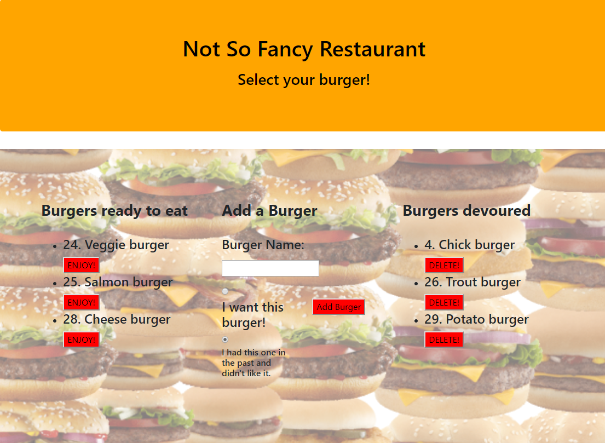

# YummyBurger


**Goal**


This one-page App allows the users to input the names of burgers they would like to eat. The app stores the information in MySQL database. After the user "eats" the burger, the name is moved to the list of devoured burgers. There is an option of creating and placing burgers eaten in the past directly on the devoured list. The user can then delete the burgers.


**Accessing the Service**


You can find the service on
[GitHub]( https://obscure-beyond-13683.herokuapp.com/)


**User Flow**

1. Not So Fancy Restaurant




* Whenever users submit burger names they want to eat, the app displays the names on the left side of the page, waiting to be devoured.
* Each burger in the waiting area also has an Eat! button. When the user clicks on it, the burger moves to the right side of the page.
* The user also has an option to create burgers eaten in the past and adding them to the devoured list.
* The app stores every burger in a database, whether eaten or not.
* The user can delete burgers on the devoured list by clicking the delete button.

 

**CRUD**

* Code for creating, updating and deleting burgers in burgersController.js


```javascript

router.post("/api/burgers", function(req, res) {

  burger.create([
    "burger_name", "devoured"
  ], [
    req.body.burger_name, req.body.devoured
  ], function(result) {
    // Send back the ID of the new quote
    res.json({ id: result.insertId });
  });
});

router.put("/api/burgers/:id", function(req, res) {
  var condition = "id = " + req.params.id;

  console.log("condition", condition);

  burger.update({
    devoured: req.body.devoured
  }, condition, function(result) {
    if (result.changedRows == 0) {
      // If no rows were changed, then the ID must not exist, so 404
      return res.status(404).end();
    } else {
      res.status(200).end();
    }
  });
});

router.delete("/api/burgers/:id", function(req, res) {
  var condition = "id = " + req.params.id;

  console.log("condition", condition);

  burger.delete(condition, function(result) {
    if (result.affectedRows == 0) {
      // If no rows were changed, then the ID must not exist, so 404
      return res.status(404).end();
    } else {
      res.status(200).end();
    }
  });
});
